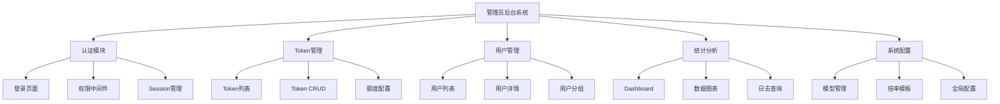

# 功能规划：管理员后台系统

**规划时间**：2026-02-08
**预估工作量**：68 任务点

---

## 1. 功能概述

### 1.1 目标
为 New API 平台开发完整的管理员后台系统，实现对 API Keys、用户、额度、模型权限等资源的全面管理。

### 1.2 范围
**包含**：
- 管理员认证与权限验证
- Token/Key 完整 CRUD 管理
- 用户管理与分组
- 额度配置与倍率设置
- 模型权限管理
- 统计分析与数据可视化
- 系统配置管理

**不包含**：
- 用户端功能修改（已完成）
- 支付集成
- 多租户架构
- 实时监控告警

### 1.3 技术约束
- **前端**：Next.js 16 + React 19 + TypeScript
- **UI**：Tailwind CSS 4 + shadcn/ui
- **状态管理**：Zustand
- **后端 API**：New API (https://api-cli.proxy.vesper36.cc)
- **路由**：Next.js App Router
- **认证**：基于 Session/Token 的管理员认证

---

## 2. WBS 任务分解

### 2.1 分解结构图

---

## 3. 详细任务清单

### 模块 A：基础架构（8 任务点）

#### A.1 扩展 API 客户端（3 点）

**文件**: `/Users/vesper/workspace/project/v-ai/lib/api/admin-api.ts`

- [ ] **任务 A.1.1**：创建 AdminAPIClient 类（2 点）
  - **输入**：现有 NewAPIClient 实现
  - **输出**：支持管理员接口的 API 客户端
  - **关键步骤**：
    1. 继承或扩展 NewAPIClient
    2. 添加管理员 Token 认证头
    3. 实现 `/api/token` 相关方法（GET, POST, PUT, DELETE）
    4. 实现 `/api/user` 管理接口
    5. 实现 `/api/channel` 渠道管理接口
    6. 添加错误处理和类型定义

- [ ] **任务 A.1.2**：定义管理员类型（1 点）
  - **输入**：New API 文档
  - **输出**：完整的 TypeScript 类型定义
  - **关键步骤**：
    1. 创建 `/Users/vesper/workspace/project/v-ai/lib/types/admin.ts`
    2. 定义 Token、User、Channel、Redemption 类型
    3. 定义请求/响应类型
    4. 导出到 index.ts

#### A.2 状态管理扩展（2 点）

**文件**: `/Users/vesper/workspace/project/v-ai/lib/store/useAdminStore.ts`

- [ ] **任务 A.2.1**：创建管理员状态管理（2 点）
  - **输入**：现有 useStore 实现
  - **输出**：管理员专用 Zustand store
  - **关键步骤**：
    1. 创建 useAdminStore
    2. 添加管理员登录状态（isAdmin, adminToken）
    3. 添加 Token 列表缓存
    4. 添加用户列表缓存
    5. 添加筛选、排序、分页状态
    6. 实现持久化（仅 adminToken）

#### A.3 路由保护中间件（3 点）

**文件**: `/Users/vesper/workspace/project/v-ai/middleware.ts`

- [ ] **任务 A.3.1**：实现管理员权限验证（3 点）
  - **输入**：Next.js middleware 规范
  - **输出**：完整的路由保护逻辑
  - **关键步骤**：
    1. 检查 `/admin/*` 路由
    2. 验证 Cookie 中的 adminToken
    3. 调用 New API 验证 Token 有效性
    4. 未登录重定向到 `/admin/login`
    5. 已登录访问 login 页面重定向到 `/admin`
    6. 添加白名单路由（login, api）

---

### 模块 B：认证系统（6 任务点）

#### B.1 登录页面（3 点）

**文件**: `/Users/vesper/workspace/project/v-ai/app/admin/login/page.tsx`

- [ ] **任务 B.1.1**：创建登录 UI（2 点）
  - **输入**：shadcn/ui 组件
  - **输出**：完整的登录页面
  - **关键步骤**：
    1. 创建登录表单（用户名、密码）
    2. 使用 react-hook-form + zod 验证
    3. 添加加载状态和错误提示
    4. 实现响应式布局
    5. 添加"记住我"选项

- [ ] **任务 B.1.2**：实现登录逻辑（1 点）
  - **输入**：AdminAPIClient
  - **输出**：完整的登录流程
  - **关键步骤**：
    1. 调用 New API 登录接口
    2. 存储 adminToken 到 Cookie
    3. 更新 useAdminStore 状态
    4. 登录成功跳转到 `/admin`
    5. 错误处理和提示

#### B.2 登录 API 路由（2 点）

**文件**: `/Users/vesper/workspace/project/v-ai/app/api/admin/login/route.ts`

- [ ] **任务 B.2.1**：实现登录 API（2 点）
  - **输入**：用户名、密码
  - **输出**：JWT token 或 session
  - **关键步骤**：
    1. 验证请求体格式
    2. 调用 New API 认证接口
    3. 设置 HttpOnly Cookie
    4. 返回用户信息
    5. 记录登录日志

#### B.3 登出功能（1 点）

**文件**: `/Users/vesper/workspace/project/v-ai/app/api/admin/logout/route.ts`

- [ ] **任务 B.3.1**：实现登出 API（1 点）
  - **输入**：当前 session
  - **输出**：清除认证状态
  - **关键步骤**：
    1. 清除 Cookie
    2. 清除 useAdminStore 状态
    3. 返回成功响应

---

### 模块 C：Token 管理（18 任务点）

#### C.1 Token 列表页面（6 点）

**文件**: `/Users/vesper/workspace/project/v-ai/app/admin/tokens/page.tsx`

- [ ] **任务 C.1.1**：创建 Token 列表 UI（4 点）
  - **输入**：shadcn/ui Table 组件
  - **输出**：完整的 Token 列表页面
  - **关键步骤**：
    1. 创建数据表格组件
    2. 显示字段：ID、名称、状态、额度、创建时间、操作
    3. 实现排序功能（按创建时间、额度）
    4. 实现筛选功能（状态、名称搜索）
    5. 实现分页（每页 20 条）
    6. 添加批量操作（启用/禁用、删除）
    7. 添加"新建 Token"按钮

- [ ] **任务 C.1.2**：实现数据加载逻辑（2 点）
  - **输入**：AdminAPIClient
  - **输出**：Token 列表数据
  - **关键步骤**：
    1. 调用 GET /api/token 接口
    2. 处理分页参数
    3. 实现加载状态
    4. 错误处理和重试
    5. 缓存到 useAdminStore

#### C.2 Token 创建/编辑（6 点）

**文件**: `/Users/vesper/workspace/project/v-ai/app/admin/tokens/[id]/page.tsx`

- [ ] **任务 C.2.1**：创建 Token 表单组件（4 点）
  - **输入**：shadcn/ui Form 组件
  - **输出**：Token 配置表单
  - **关键步骤**：
    1. 创建表单字段：
       - 名称（必填）
       - 额度（数字输入）
       - 倍率（下拉选择）
       - 模型权限（多选）
       - 速率限制（RPM/RPD）
       - 过期时间（日期选择器）
       - 状态（启用/禁用）
    2. 使用 react-hook-form + zod 验证
    3. 实现动态模型列表加载
    4. 添加预设模板选择
    5. 实时预览配置

- [ ] **任务 C.2.2**：实现保存逻辑（2 点）
  - **输入**：表单数据
  - **输出**：创建/更新 Token
  - **关键步骤**：
    1. 区分创建/编辑模式
    2. 调用 POST /api/token 或 PUT /api/token/:id
    3. 验证数据完整性
    4. 成功后跳转到列表页
    5. 显示成功/失败提示

#### C.3 Token 详情页面（3 点）

**文件**: `/Users/vesper/workspace/project/v-ai/components/admin/TokenDetail.tsx`

- [ ] **任务 C.3.1**：创建详情展示组件（3 点）
  - **输入**：Token ID
  - **输出**：Token 详细信息页面
  - **关键步骤**：
    1. 显示基本信息卡片
    2. 显示使用统计（调用次数、消耗额度）
    3. 显示最近调用日志
    4. 添加操作按钮（编辑、删除、复制 Key）
    5. 实现刷新功能

#### C.4 Token 删除功能（2 点）

**文件**: `/Users/vesper/workspace/project/v-ai/app/api/admin/tokens/[id]/route.ts`

- [ ] **任务 C.4.1**：实现删除 API（2 点）
  - **输入**：Token ID
  - **输出**：删除确认
  - **关键步骤**：
    1. 实现 DELETE 方法
    2. 添加二次确认对话框
    3. 调用 DELETE /api/token/:id
    4. 更新缓存
    5. 显示成功提示

#### C.5 批量操作（1 点）

**文件**: `/Users/vesper/workspace/project/v-ai/components/admin/TokenBatchActions.tsx`

- [ ] **任务 C.5.1**：实现批量操作（1 点）
  - **输入**：选中的 Token IDs
  - **输出**：批量启用/禁用/删除
  - **关键步骤**：
    1. 添加复选框选择
    2. 实现批量 API 调用
    3. 显示进度条
    4. 错误处理（部分失败）

---

